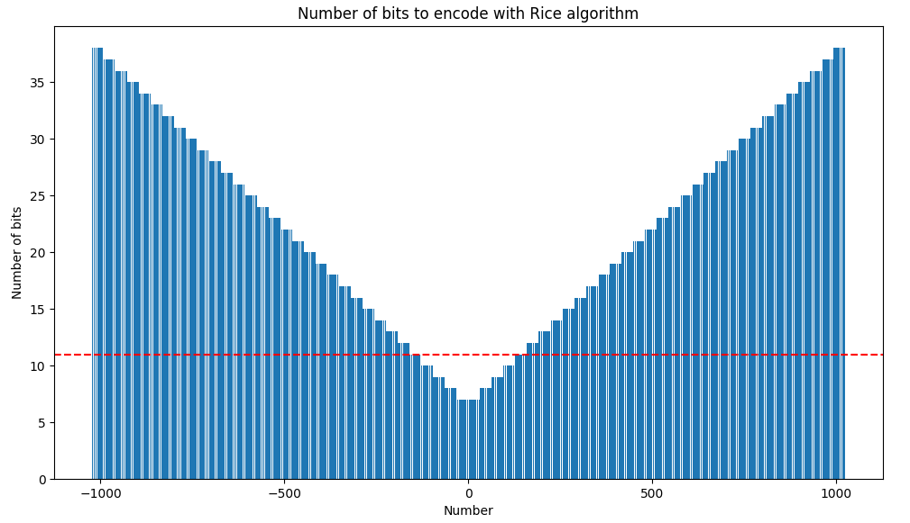
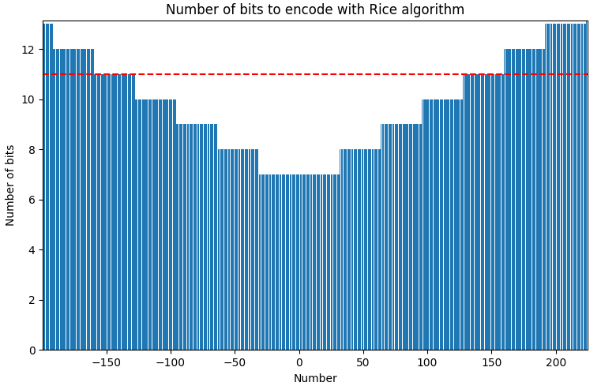
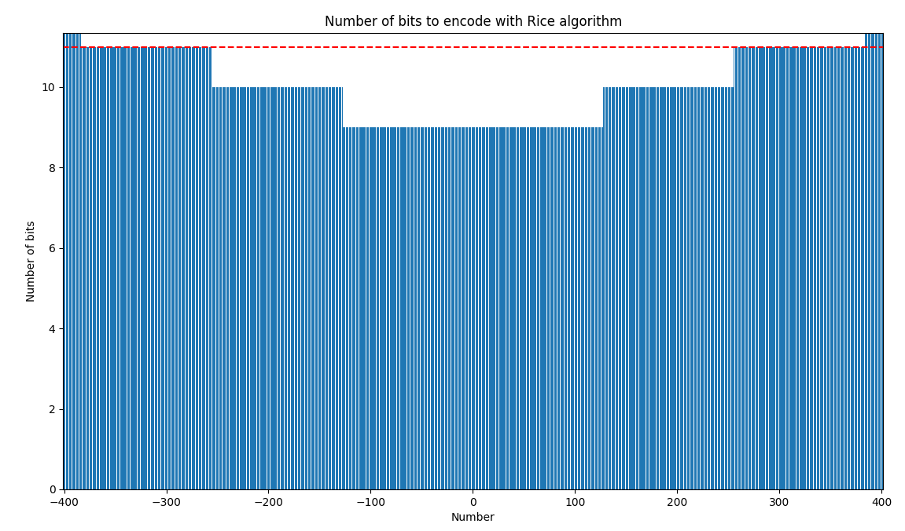
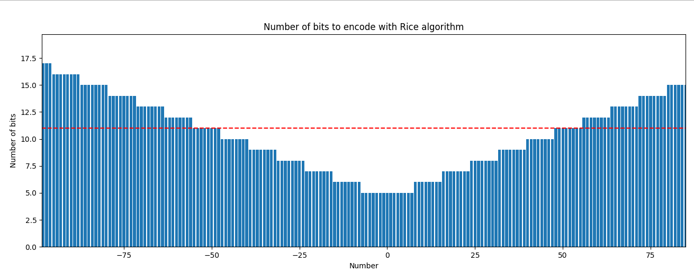

# Multimedia_Rice
## Description
The idea of this code is to do a Rice encoder. 

For the algorithm we need a value M that will be a power of 2 and a value N that will be the number to codify.
    - We have to calculate the sign of the number N. If the number is positive or 0 we will write the sign as 1, if the number is negative we will write the number as 0. 
    - The second step is to calculate the quotient by dividing the absolute value of the number divided by the number M. 
    - The reminder is the absolute value of the number N mod M. 

So in order to generate the code we have to write the < sign > < quotient > < reminder >.

## Work to develop
a) How many bits are needed to encode all integers between -1023 and +1023 (in natural binary encoding with a sign bit)?

b) Calculate the Rice code for all integers N between -1023 and +1023 with M = 32.

c) For what range of values of N does the Rice code require fewer bits than the natural binary encoding with a sign bit necessary to represent the entire range between -1023 and +1023? If the majority of data to be encoded belongs to this range (optimal input range), the use of Rice code will be advisable (there will be a bit savings). What is the maximum bit savings?

d) For what value of M does the optimal input range extend between -255 and +255? What is the maximum bit savings now?

e) What is the largest value of M that allows achieving a maximum savings of up to 6 bits? What is the optimal input range now?

## Execution of the code
First you have to install the requirements.txt located in the main directory using this code: 

> 
    pip install -r requirements.txt

To run the code you have to go to the folder that contains the main.py, in this case the address of this folder is: MULTIMEDIA_RICE/src/ and in this directory we will find the main.py
The next step is to execute the main.py file using the command:

> 
    python main.py

*Maybe you have to use python3 instead of python. 

## Execution of the documentation
To run the documentation using mk you must do the following, from the root folder:

***Important**: you must install the requirements first*.

> 
    mkdocs build
    

> 
    mkdocs serve

When you run the serve, you will get the web page address on the command line, so you have to open it on your browser. 

## Resolution
a) How many bits are needed to encode all integers between -1023 and +1023 (in natural binary encoding with a sign bit)?

    We need at least 11bits, 10 for the number representation plus one for the sign

b) Calculate the Rice code for all integers N between -1023 and +1023 with M = 32.

    Executing the code we can see this result.
    

c) For what range of values of N does the Rice code require fewer bits than the natural binary encoding with a sign bit necessary to represent the entire range between -1023 and +1023? If the majority of data to be encoded belongs to this range (optimal input range), the use of Rice code will be advisable (there will be a bit savings). What is the maximum bit savings?

We can see how from -128 to 128 the M = 32 works well. However, other values are not working. So if the most part of our values are inside that range, this is a good number

Best codification with Rice algorithm is for the number: -31
Difference between the natural binary codification and the Rice codification for the number -31 is: 4 bits.
This makes sense since it must always use the residue bits, and in change it does not use any quotient bits. That is why all values below M will always be the best encoded. However, we will not always save bits. This depends on the bits used before encoding and the M used.

d) For what value of M does the optimal input range extend between -255 and +255? What is the maximum bit savings now?

We search between 64, 128 and 256 to see which one is the best for the range -256 to 256. that's because we already know that 32 doesn't work well for more than 128
[ M = 64 ] Total length for numbers between -256 and 256: 4880
[ M = 128 ] Total length for numbers between -256 and 256: 4877
[ M = 256 ] Total length for numbers between -256 and 256: 5132
The best M is: 4877
Difference between the natural binary codification and the Rice codification for the number -127 is: 2 bits. So the maximum bit saving are 2.

e) What is the largest value of M that allows achieving a maximum savings of up to 6 bits? What is the optimal input range now?

    For M = 2 the maximal difference is: 8 bits. Minimal value: -1
    For M = 4 the maximal difference is: 7 bits. Minimal value: -3
    For M = 8 the maximal difference is: 6 bits. Minimal value: -7
    For M = 16 the maximal difference is: 5 bits. Minimal value: -15
    For M = 32 the maximal difference is: 4 bits. Minimal value: -31
    For M = 64 the maximal difference is: 3 bits. Minimal value: -63
    For M = 128 the maximal difference is: 2 bits. Minimal value: -127
    For M = 256 the maximal difference is: 1 bits. Minimal value: -255

    The M that has a maximal difference of 6 is: M = 8. 

    We can see how  the optimal input range in this case is [-64,64].

## Developed by 
- Oscar Blazquez Jimenez
- Sara San José Gómez